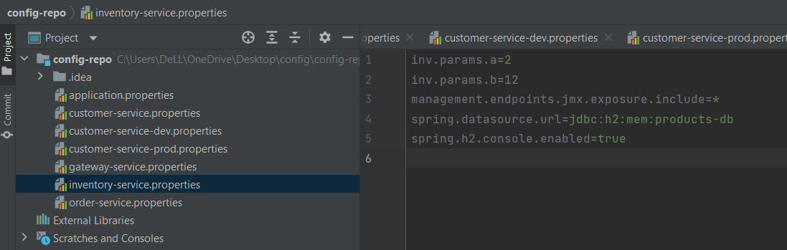

# Activité pratique N° 3 - Architectures Micro services avec (Spring Cloud Config, Consul Discovery, Consul Config,Vault)
 ## 1. Consul Discovery

## 2. Spring Cloud Config

## 3. Spring Cloud Gateway

## 4. Customer-service

## 5. Inventory Service

## 6. Order Service

## 7. Consul Config (Billing Service)

## 8. Vault (Billing Service)

## 9. Frontend Web avec Angular

